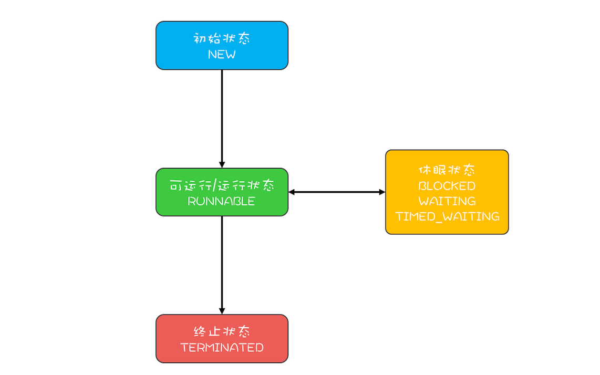

网课 Java 并发编程实战.md

# 可见性、原子性、有序性

一个线程对共享变量的修改，另一个线程能够立刻看到，我们称为可见性。

我们把一个或者多个操作在CPU执行的过程中不被中断的特性称为原子性。

有序性指的是程序按照代码的先后顺序执行。

## Java内存模型: 看Java如何解决可见性和有序性问题

### volatile

原始意义是禁用CPU缓存。

### Happens-Before 规则

前面一个操作的结果对后续操作是可见的。

1.程序的顺序性规则。

在一个线程中，按照程序顺序，前面的操作Happens-before与后续的任意操作。

2.volatile变量规则

这条规则是指对一个volatile变量的写操作，Happens-Before于后续对这个volatile变量的读操作。

3.传递性。

这条规则是指如果A Happens-Before B，且B Happens-Before C，那么A Happens-Before C。


4.管程中锁的规则

这条规则是指对一个锁的解锁Happens-Before于后续对这个所得枷锁。

管程是一种通用的同步原语，在Java中指的就是synchronized,synchronized是Java里对管程的实现。


5.线程start()规则

这条是关于线程启动的。它是指主线程A启动子线程B后，子线程B能够看到主线程在启动子线程B前的操作。

换句话说就是，如果线程A调用线程B的 start() 方法（即在线程A中启动线程B），那么该start()操作 Happens-Before 于线程B中的任意操作。


6. 线程join()规则

这条是关于线程等待的。它是指主线程A等待子线程B完成（主线程A通过调用子线程B的join()方法实现），当子线程B完成后（主线程A中join()方法返回），主线程能够看到子线程的操作。当然所谓的“看到”，指的是对共享变量的操作。

换句话说就是，如果在线程A中，调用线程B的 join() 并成功返回，那么线程B中的任意操作Happens-Before 于该 join() 操作的返回。

## 被我们忽略的final

final修饰变量时，初衷是告诉编译器：这个变量生而不变，可以可劲儿优化。

发布一个对象的意思是使它能够被当前范围之外的代码所使用。
逸出是指一个对象在尚未准备好时就将它发布。


# 解决原子性问题

原子性问题的源头是线程切换。

”同一时刻只有一个线程执行“,我们称之为互斥。

我们把一段需要互斥执行的代码称为临界区。

## synchronized

```java

class X{
	//修饰非静态方法 锁的是this
	synchronized void foo(){
	//临界区
	}
	//修饰静态方法 锁的是X.class
	synchronized static void bar(){
		//临界区
	}
	//修饰代码块 锁的是指定对象obj
	Object obj=new Object();
	void baz(){
		synchronized(obj){
			//临界区
		}
	}
}

```

当修饰静态方法的时候，锁定的是当前类的Class对象，在上面的例子中就是ClassX.
当修饰费静态方法的时候，锁定的是当前实例对象this。

## 锁和受保护资源的关系

一个合理的关系是:受保护资源和锁质检的关系是N:1的关系。

总结:

对于并发问题,深入分析锁定的对象和受保护资源的关系，综合考虑受保护资源的访问路径，多方面考量才能用好互斥锁.

synchronized是Java在语言层面提供的互斥原语，其实Java里面还有很多其他类型的锁，但作为互斥锁，原理都是相通的：锁，一定有一个要锁定的对象，至于这个锁定的对象要保护的资源以及在哪里加锁/解锁，就属于设计层面的事情了.

## 保护没有关联关系的多个资源

用不同的锁对受保护资源进行精细化管理，能够提升性能，叫细粒度锁。

## 保护有关联关系的多个资源

锁能覆盖所有受保护的资源。例如xxx.class作为锁的对象

总结:

对如何保护多个资源已经很有心得了，关键是要分析多个资源之间的关系。如果资源之间没有关系，很好处理，每个资源一把锁就可以了。如果资源之间有关联关系，就要选择一个粒度更大的锁，这个锁应该能够覆盖所有相关的资源。除此之外，还要梳理出有哪些访问路径，所有的访问路径都要设置合适的锁来保护。

“原子性”的本质是什么？其实不是不可分割，不可分割只是外在表现，其本质是多个资源间有一致性的要求，操作的中间状态对外不可见。例如，在32位的机器上写long型变量有中间状态（只写了64位中的32位），在银行转账的操作中也有中间状态（账户A减少了100，账户B还没来得及发生变化）。所以解决原子性问题，是要保证中间状态对外不可见。


## 一不小心死锁了，怎么办？

使用细粒度锁可以提高并发度，是性能优化的一个重要手段。

细粒度锁有可能导致死锁。

死锁的定义是:一组互相竞争资源的线程因互相等待，导致"永久"阻塞的现象。

只有以下这四个条件都发生时才会出现死锁:

1. 互斥,共享资源X和Y只能被一个线程占用;
2. 占有且等待，线程T1已经取得共享资源X,在等待共享资源Y的时候，不释放共享资源X;
3. 不可抢占,其他线程不能强行抢占线程T1占有的资源;
4. 循环等待，线程T1等待线程T2 占有的资源，线程T2等待线程T1占有的资源，就是循环等待。


预防死锁

1. 破坏占用且等待条件【保证”一次性申请所有资源“】

2. 破坏不可抢占条件 

3. 破坏循环等待条件 


## 用"等待-通知" 机制优化循环等待

一个完整的等待-通知机制:线程首先获取互斥锁，当线程要求的条件不满足时，释放互斥锁，进入等待状态;当要求的条件满足时，通知等待的线程，重新获取互斥锁。


### 尽量使用notifyAll()

notify()是会随机地通知等待队列中的一个线程,而notfiyAll()会通知等待队列中的所有线程。


## wait()方法与sleep()方法的不同之处在于:

1. wait会释放所有锁而sleep不会释放锁资源.
2. wait只能在同步方法和同步块中使用，而sleep任何地方都可以.
3. wait无需捕捉异常，而sleep需要.（都抛出InterruptedException ，wait也需要捕获异常）
4. wait()无参数需要唤醒，线程状态WAITING；wait(1000L);到时间自己醒过来或者到时间之前被其他线程唤醒，状态和sleep都是TIME_WAITING
两者相同点：都会让渡CPU执行时间，等待再次调度！


# 安全性、活跃性、性能问题

## 安全性问题

程序按照我们期望的执行。

当多个线程同时访问同一数据，并且至少有一个线程会写这个数据的时候。叫做数据竞争（Data Race）。

竞态条件，指的是程序的执行结果依赖线程执行的顺序。

## 活跃性问题

所谓活跃性问题，指的是某个操作无法执行下去。我们常见的“死锁”就是一种典型的活跃性问题，当然除了死锁外，还有两种情况，分别是“活锁”和“饥饿”。

但有时线程虽然没有发生阻塞，但仍然会存在执行不下去的情况，这就是所谓的“活锁”。

解决“活锁”的方案很简单，谦让时，尝试等待一个随机的时间就可以了。

所谓“饥饿”指的是线程因无法访问所需资源而无法执行下去的情况。

解决“饥饿”问题的方案很简单，有三种方案：一是保证资源充足，二是公平地分配资源，三就是避免持有锁的线程长时间执行。这三个方案中，方案一和方案三的适用场景比较有限，因为很多场景下，资源的稀缺性是没办法解决的，持有锁的线程执行的时间也很难缩短。倒是方案二的适用场景相对来说更多一些。

那如何公平地分配资源呢？在并发编程里，主要是使用公平锁。所谓公平锁，是一种先来后到的方案，线程的等待是有顺序的，排在等待队列前面的线程会优先获得资源。

## 性能问题

第一，既然使用锁会带来性能问题，那最好的方案自然就是使用无锁的算法和数据结构了。在这方面有很多相关的技术，例如线程本地存储(Thread Local Storage, TLS)、写入时复制(Copy-on-write)、乐观锁等；Java并发包里面的原子类也是一种无锁的数据结构；Disruptor则是一个无锁的内存队列，性能都非常好……

第二，减少锁持有的时间。互斥锁本质上是将并行的程序串行化，所以要增加并行度，一定要减少持有锁的时间。这个方案具体的实现技术也有很多，例如使用细粒度的锁，一个典型的例子就是Java并发包里的ConcurrentHashMap，它使用了所谓分段锁的技术（这个技术后面我们会详细介绍）；还可以使用读写锁，也就是读是无锁的，只有写的时候才会互斥。

性能方面的度量指标有很多，有三个指标非常重要，就是：吞吐量、延迟和并发量。

吞吐量：指的是单位时间内能处理的请求数量。吞吐量越高，说明性能越好。
延迟：指的是从发出请求到收到响应的时间。延迟越小，说明性能越好。
并发量：指的是能同时处理的请求数量，一般来说随着并发量的增加、延迟也会增加。所以延迟这个指标，一般都会是基于并发量来说的。例如并发量是1000的时候，延迟是50毫秒。 

总结:

并发编程是一个复杂的技术领域，微观上涉及到原子性问题、可见性问题和有序性问题，宏观则表现为安全性、活跃性以及性能问题。

我们在设计并发程序的时候，主要是从宏观出发，也就是要重点关注它的安全性、活跃性以及性能。安全性方面要注意数据竞争和竞态条件，活跃性方面需要注意死锁、活锁、饥饿等问题，性能方面我们虽然介绍了两个方案，但是遇到具体问题，你还是要具体分析，根据特定的场景选择合适的数据结构和算法。


## 管程:并发编程的万能钥匙

管程和信号量都是等价的，所谓等价的指的是用管程能够实现信号量,也能用信号量实现管程。

所谓管程，指的是管理共享变量以及对共享变量的操作过程，让他们支持并发。翻译为Java领域的语言，就是管理类的成员变量和成员方法，让这个类是线程安全的。

### MESA模型

在并发编程领域，有两个核心问题:一个是互斥，即同一时刻只允许一个线程访问共享资源;另一个是同步,即线程之间如何通信、协作。这两大问题，管程都是能够解决的。

```java
	
public class BlockedQueue<T>{
	final Lock lock=new ReentrantLock();
	//条件变量:队列不满
	final Condition notFull=lock.newCondition();
	//条件变量:队列不空
	final Condition notEmpty=lock.newCondition();
	//入队
	void enq(T x){
		lock.lock();
		try{
			while(队列已满)
			//等待队列不满
			notFull.await();
			//省略入队操作...
			//入队后，通知可出队
			notEmpty.signal();
		}finally{
			lock.unlock();
		}
	}
	//出队
	void deq(){
		lock.lock();
		try{
			while(队列已空)
			//等待对列不空
			notEmpty.await();
			//省略出队操作...
			//出队后,通知可入队
			notFull.signal();
		}finally{
			lock.unlock();
		}
	}
}

```

### wait()的正确姿势

MESA管程中有一个编程范式,就是需要在一个while循环里面调用wait().

```java
	while(条件不满足){
		wait();
	}

```

### notify()何时可以使用

需要满足以下三个条件:

1. 所有等待线程拥有相同的等待条件;  

2. 所有等待线程被唤醒后，执行相同的操作;

3. 只需要唤醒一个线程。


Hasen模型，Hoare模型，MESA模型一个核心区别就是当条件变量满足后，如何通知相关线程。管程要求同一时刻只允许一个线程执行，那当线程T2的操作使线程T1等待条件满足时，T1和T2究竟谁可以执行呢？

Hasen模型：要求notify放在代码的最后，这样T2通知完后，T2就结束了，然后T1再执行，这样就保证了同一个时刻只有一个线程执行。

Hoare模型：T2通过完T1后，T2阻塞，T1马上执行；等T1执行完，再唤醒T2，也能保证同一个时刻只有一个线程执行。相比Hasen模型，T2多了一次阻塞唤醒操作。

MESA模型：T2通知完T1后，T2还是会接着执行，T1并不立即执行，仅仅是从条件变量的等待队列进到入口等待队列里面。这样做的好处：notify不需要放到代码最后，T2也没有多余的阻塞唤醒操作。坏处：就是当T1再次执行的时候，可能曾经满足的条件，现在已经不满足了，所以需要以循环方式检验条件变量。


## Java线程(上):Java线程的生命周期

### 通用的线程生命周期

初始状态、可以运行状态、运行状态、休眠状态和终止状态。

1. 初始状态，指的是线程已经被创建，但是还不允许分配CPU执行。这个状态属于编程语言特有的，不过这里所谓的被创建，仅仅是在编程语言层面被创建，而在操作系统层面，真正的线程还没有创建。

2. 可运行状态,指的是线程可以分配CPU执行。在这种情况下，真正的操作系统线程已经被成功创建了，所以可以分配CPU执行。

3. 当有空闲的CPU时，操作系统会将其他分配给一个处于可运行状态的线程，被分配到CPU的线程的状态就转换成运行状态。

4. 运行装填的线程如果调用一个阻塞的API(例如以阻塞方式读文件)或者等待某个事件(例如条件变量),那么线程的状态就会转换到休眠状态，同事释放CPU使用权，休眠状态的线程永远没有机会获得CPU使用权。当等待的事件出现了，线程就会从休眠状态转换到可运行状态。

5.线程执行完或者出现异常就会进入终止状态，终止状态的线程不会切换到其他任何状态，进入终止状态也就意味着线程的生命周期结束了。

## Java中线程的生命周期

1. NEW(初始化状态)   
2. RUNNABLE（可运行/运行状态） 
3. BLOCKED（阻塞状态） 
4. WAITING（无时限等待） 
5. TIMED_WAITING（有时限等待）  
6. TERMINATED（终止状态）

Java线程中的BLOCKED、WAITING、TIMED_WAITING是一种状态，即休眠状态。也就是说Java线程处于这三种状态之一，那么这个线程就永远没有CPU的使用权。




1. RUNNABLE与BLOCKED的状态转换

只有一个场景会触发这种转换，就是线程的等待synchronized的隐式锁。JVM层面并不关心操作系统调度相关的状态。

2. RUNNBALE与WAITING的状态转换

第一种场景,获得synchronized隐式锁的线程，调用无参数的Object.wait()方法。

第二种场景,调用无参数的Thead.join()方法。其中的join()是一种线程同步方法，例如有一个线程对象thread A,当调用A.join()的时候，执行这条语句的线程会等待thread A执行完，而等待中的这个线程，其状态会从RUNNABLE转换到WAITING.当线程thread A执行完，原来等待它的线程又会从WAITING状态转换到RUNNABLE.

第三种场景,调用LockSupport.park()方法。其中的LockSupport对象，也许你有点陌生，其实Java并发包中的锁，都是基于它实现的。调用LockSupport.park()方法，当前线程会阻塞，线程的状态会从RUNNABLE转换到WAITING。调用LockSupport.unpark(Thread thread)可唤醒目标线程，目标线程的状态又会从WAITING状态转换到RUNNABLE。


3. RUNNABLE与TIMED_WAITING的状态

有五种场景会触发这种转换：

a. 调用带超时参数的Thread.sleep(long millis)方法；
b. 获得synchronized隐式锁的线程，调用带超时参数的Object.wait(long timeout)方法；
c. 调用带超时参数的Thread.join(long millis)方法；
d. 调用带超时参数的LockSupport.parkNanos(Object blocker, long deadline)方法；
e. 调用带超时参数的LockSupport.parkUntil(long deadline)方法。

4. 从NEW到RUNNABLE状态

Java刚创建出来的Thread对象就是NEW状态,而创建Thread对象主要有两种方法。一种是继承Thread对象，重写run方法，一种是实现Runnable接口重写run方法，并将该实现类作为创建Thread对象的参数.

```java
	
	//自定义线程对象
class MyThread extends Thread{
	public void run(){
		//线程需要执行的代码
		........
	}
}
MyThread myThread = new MyThread();


//实现Runnable接口

class Runner implements Runnable{
	@Override
	public void run(){
		//线程需要执行的代码
		......
	}
}
//创建线程对象

Thread thread=new Thread(new Runner());

```

5. 从RUNNABLE到TERMINGARED状态

线程执行完run()方法后,会自动转换到TERMINATED状态,当然如果执行run()方法的时候异常抛出，也会导致线程终止。有时候我们需要强制中断run()方法的执行，调用Interrupt()方法。

### stop()和interrupt()方法的主要区别

stop()方法会真的杀死线程，类似的方法还有suspend() 和 resume()方法。不建议使用

interrupt()方法.当线程A处于WAITING、TIMED_WAITING状态时，如果其他线程调用线程A的interrupt()方法，会使线程A返回RUNNBALE状态，同是线程A的代码会触发InterruptException异常。

当线程A处于RUNNABLE状态时,并且阻塞在java.nio.channels.InterruptibleChannel上时，如果其他线程调用线程A的interrupt()方法,线程A会触发java.nio.channels.ClosedByInterruptException这个异常;而阻塞在java.nio.channels.Selector上时，如果其他线程调用线程A的interrupt()方法,线程A的java.nio.channels.Selector会立即返回。

上面这两种情况属于被中断的线程通过异常的方式获得了通知.还有一种是主动检测,如果线程处与RUNNABLE状态，并且没有阻塞在某个I/O操作上，例如中断计算圆周率的线程A,这时就得依赖线程A主动检测中断状态了。如果其他线程调用线程A的Interrupt()方法，那么线程A可以通过isInterrupted()方法，检测是不是自己呗中断了。

### 总结

理解Java线程的各种状态以及生命周期对于诊断多线程Bug非常有帮助，多线程程序很难调试，出了Bug基本上都是靠日志，靠线程dump来跟踪问题，分析线程dump的一个基本功就是分析线程状态，大部分的死锁、饥饿、活锁问题都需要跟踪分析线程的状态。同时，本文介绍的线程生命周期具备很强的通用性，对于学习其他语言的多线程编程也有很大的帮助。


## Java线程(中): 创建多少线程才是合适的?

### 为什么要使用多线程

降低延迟，提高吞吐量.

延迟指的是发出请求但收到响应这个过程的时间;

吞吐量指的是在单位时间内能处理请求的数量;

### 多线程的应用场景

在并发编程领域,提升性能本质上就是提升硬件的利用率，再具体点来说，就是提升I/O的利用率和CPU的利用率。

如果CPU和I/O设备的利用率都很低，那么可以尝试通过增加线程来提高吞吐量。

### 创建多选线程合适

对于CPU密集型的计算场景,理论上"线程的数量=CPU核数"就是最合适的，不过在工程上，线程的数量一般会设置为”CPU核数+1“。

对于I/O密集型计算场景

最佳线程数=1+(I/O耗时/CPU耗时)

多核CPU:

最佳线程数=CPUx核数[1+(I/O耗时/CPU耗时)]


## Java线程(下)： 为什么局部变量是线程安全的?

CPU内置了栈寄存器.CPU支持一种栈结构,调用栈。

局部变量的作用域就是方法内部，也就是当方法执行
完,局部变量就没用了，局部变量硬功和方法同生共死。局部变量是放到了调用栈里。

每个线程都有自己独立的调用栈。


### 线程封闭

方法里的局部变量，因为不会和其他线程共享，所以没有并发问题。仅在单线程内访问数据。


## 如何用面向对象思想写好并发程序?

### 封装共享变量

面型对象思想里面有一个重要的特性是封装，封装的通俗解释就是将属性和实现细节封装在对象内部,外界对象只能通过目标对象提供的公共方法来间接访问这些内部属性。我们把共享变量作为对象的属性，那对于共享变量的访问路径就是对象的公共方法。

将共享变量作为对象属性封装在内部，对所有公共方法指定并发访问策略。

对于不会发生变化的共享变量，使用fianl关键字来修饰。这样既能避免并发问题，也能明了表明设计意图。


### 识别共享变量间的约束条件

识别共享变量间的约束条件非常重要。因为这些约束条件，决定了并发访问策略。

在设计阶段，我们一定要识别出所有共享变量之间的约束条件，如果约束条件识别不足，很可能导致制定的并发访问策略南辕北辙。

共享变量之间的约束条件，反映在代码里，基本上都会有if语句，所以，一定要特别注意竞态条件。


### 制定并发访问策略

1. 避免共享：避免共享的技术主要是利于线程本地存储以及为每个任务分配独立的线程。
2. 不变模式：这个在Java领域应用的很少，但在其他领域却有着广泛的应用，例如Actor模式、CSP模式以及函数式编程的基础都是不变模式。
3. 管程及其他同步工具：Java领域万能的解决方案是管程，但是对于很多特定场景，使用Java并发包提供的读写锁、并发容器等同步工具会更好。 

宏观原则:

1. 优先使用成熟的工具类：Java SDK并发包里提供了丰富的工具类，基本上能满足你日常的需要，建议你熟悉它们，用好它们，而不是自己再“发明轮子”，毕竟并发工具类不是随随便便就能发明成功的。
2. 迫不得已时才使用低级的同步原语：低级的同步原语主要指的是synchronized、Lock、Semaphore等，这些虽然感觉简单，但实际上并没那么简单，一定要小心使用。
3. 避免过早优化：安全第一，并发程序首先要保证安全，出现性能瓶颈后再优化。在设计期和开发期，很多人经常会情不自禁地预估性能的瓶颈，并对此实施优化，但残酷的现实却是：性能瓶颈不是你想预估就能预估的。


